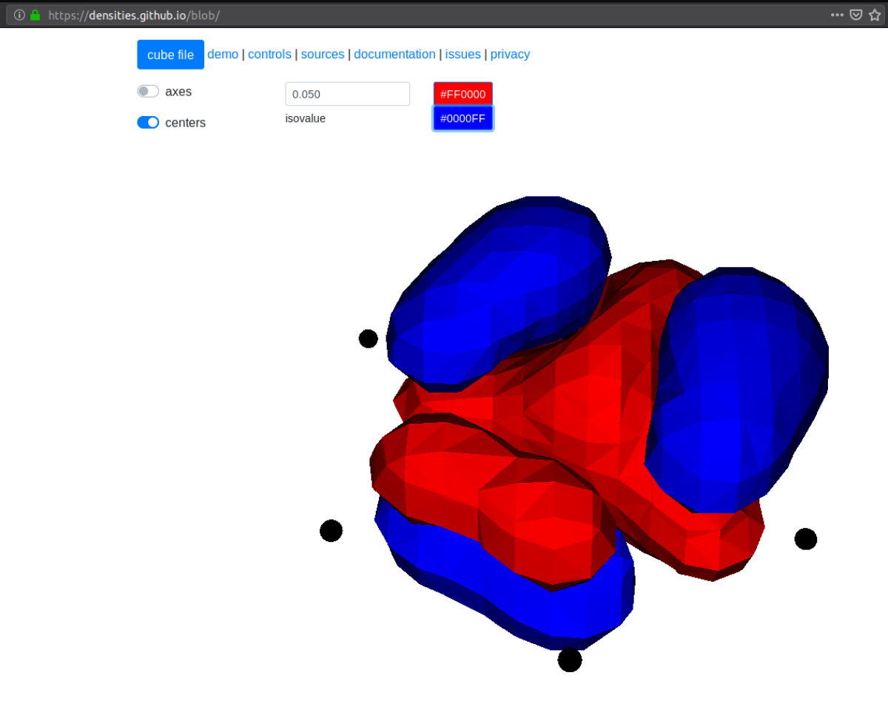

---------------
User input file
---------------

The input file is organized in sections and keywords that can be of different
type. Input keywords and sections are **case-sensitive**, while `values` are
**case-insensitive**.

.. code-block:: bash

    Section {
      keyword_1 = 1                         # int
      keyword_2 = 3.14                      # float
      keyword_3 = [1, 2, 3]                 # int array
      keyword_4 = foo                       # string
      keyword_5 = true                      # boolean
    }

Valid options for booleans are ``true/false``, ``on/off`` or ``yes/no``. Single
word strings can be given without quotes (be careful of special characters, like
slashes in file paths). A  complete list of available input keywords can be
found in the :ref:`User input reference`.

Top section
-----------

The main input section contain four keywords: the relative precision
:math:`\epsilon_{rel}` that will be guaranteed in the calculation and the size,
origin and unit of the computational domain. The top section is not specified
by name, just write the keywords directly, e.g

.. code-block:: bash

    world_prec = 1.0e-5                     # Overall relative precision
    world_size = 5                          # Size of domain 2^{world_size}
    world_unit = bohr                       # Global length unit
    world_origin = [0.0, 0.0, 0.0]          # Global gauge origin

The relative precision sets an upper limit for the number of correct digits
you are expected to get out of the computation (note that
:math:`\epsilon_{rel}=10^{-6}` yields :math:`\mu` Ha accuracy for the hydrogen
molecule, but only mHa accuracy for benzene).

The computational domain is always symmetric around the origin, with *total*
size given by the ``world_size`` parameter as :math:`[2^n]^3`, e.i.
``world_size = 5`` gives a domain of :math:`[-16,16]^3`.
Make sure that the world is large enough to allow the molecular density to
reach zero on the boundary. The ``world_size`` parameter can be left out,
in which case the size will be estimated based on the molecular geometry.
The ``world_unit`` relates to **all** coordinates given in the input file and
can be one of two options: ``angstrom`` or ``bohr``.

.. note::

    The ``world_size`` will be only approximately scaled by the angstrom unit,
    by adding an extra factor of 2 rather than the appropriate factor of ~1.89.
    This means that e.g. ``world_size = 5`` (:math:`[-16,16]^3`) with
    ``world_unit = angstrom`` will be translated into :math:`[-32,32]^3` bohrs.

Precisions
----------

MRChem uses a smoothed nuclear potential to avoid numerical problems in
connection with the :math:`Z/|r-R|` singularity. The smoothing is controlled by
a single parameter ``nuc_prec`` that is related to the expected error in the
energy due to the smoothing. There are also different precision parameters for
the `construction` of the Poisson and Helmholtz integral operators.

.. code-block:: bash

    Precisions {
      nuclear_prec = 1.0e-6                 # For construction of nuclear potential
      poisson_prec = 1.0e-6                 # For construction of Poisson operators
      helmholtz_prec = 1.0e-6               # For construction of Helmholtz operatos
    }

By default, all precision parameters follow ``world_prec`` and usually don't
need to be changed.

Printer
-------

This section controls the format of the printed output file (``.out``
extension). The most important option is the ``print_level``, but it also gives
options for number of digits in the printed output, as well as the line width
(defaults are shown):

.. code-block:: bash

    Printer {
      print_level = 0                       # Level of detail in the printed output
      print_width = 75                      # Line width (in characters) of printed output
      print_prec = 6                        # Number of digits in floating point output
    }

Note that energies will be printed with *twice* as many digits.
Available print levels are:

- ``print_level=-1`` no output is printed
- ``print_level=0`` prints mainly properties
- ``print_level=1`` adds timings for individual steps
- ``print_level=2`` adds memory and timing information on ``OrbitalVector`` level
- ``print_level=3`` adds details for individual terms of the Fock operator
- ``print_level=4`` adds memory and timing information on ``Orbital`` level
- ``print_level>=5`` adds debug information at MRChem level
- ``print_level>=10`` adds debug information at MRCPP level

MPI
---

This section defines some parameters that are used in MPI runs (defaults shown):

.. code-block:: bash

    MPI {
      bank_size = -1                        # Number of processes used as memory bank
      omp_threads = -1                      # Number of omp threads to use
      numerically_exact = false             # Guarantee MPI invariant results
      share_nuclear_potential = false       # Use MPI shared memory window
      share_coulomb_potential = false       # Use MPI shared memory window
      share_xc_potential = false            # Use MPI shared memory window
    }

The memory bank will allow larger molecules to get though if memory is the
limiting factor, but it will be slower, as the bank processes will not take
part in any computation. For calculations involving exact exchange (Hartree-Fock
or hybrid DFT functionals) a memory bank is **required** whenever there's more
than one MPI process. A negative bank size will set it automatically based on
the number of available processes. For pure DFT functionals on smaller molecules
it is likely more efficient to set `bank_size = 0`, otherwise it's recommended
to use the default. If a particular calculation runs out of memory, it might
help to increase the number of bank processes from the default value.

The number of threads to use in OpenMP can be forced using the omp_threads flag.
For MPI runs, it is strongly advised to leave the default, as the optimal value
can be difficult to guess. The environment variable OMP_NUM_THREADS is not used
for MPI runs.

The ``numerically_exact`` keyword will trigger algorithms that guarantee that
the computed results are invariant (within double precision) with respect to
the number or MPI processes. These exact algorithms require more memory and are
thus not default. Even when the numbers are *not* MPI invariant they should be
correct and identical within the chosen ``world_prec``.

The ``share_potential`` keywords are used to share the memory space for the
particular functions between all processes located on the same physical machine.
This will save memory but it might slow the calculation down, since the shared
memory cannot be "fast" memory (NUMA) for all processes at once.

Basis
-----

This section defines the polynomial MultiWavelet basis

.. code-block:: bash

    Basis {
      type = Interpolating                  # Legendre or Interpolating
      order = 7                             # Polynomial order of MW basis
    }

The MW basis is defined by the polynomial order :math:`k`, and the type of
scaling functions: Legendre or Interpolating polynomials (in the current
implementation it doesn't really matter which type you choose). Note that
increased precision requires higher polynomial order (use e.g :math:`k = 5`
for :math:`\epsilon_{rel} = 10^{-3}`, and :math:`k = 13` for
:math:`\epsilon_{rel} = 10^{-9}`, and interpolate in between). If the ``order``
keyword is left out it will be set automatically according to

.. math:: k=-1.5*log_{10}(\epsilon_{rel})

The Basis section can usually safely be omitted in the input.

Molecule
--------

This input section specifies the geometry (given in ``world_unit`` units),
charge and spin multiplicity of the molecule, e.g. for water (coords must be
specified, otherwise defaults are shown):

.. code-block:: bash

    Molecule {
      charge = 0                            # Total charge of molecule
      multiplicity = 1                      # Spin multiplicity
      translate = false                     # Translate CoM to world_origin
    $coords
    O   0.0000     0.0000     0.0000        # Atomic symbol and coordinate
    H   0.0000     1.4375     1.1500        # Atomic symbol and coordinate
    H   0.0000    -1.4375     1.1500        # Atomic symbol and coordinate
    $end
    }

Since the computational domain is always cubic and symmetric around the origin
it is usually a good idea to ``translate`` the molecule to the origin (as long
as the ``world_origin`` is the true origin).

WaveFunction
------------

Here we give the wavefunction method, environment used (for solvent models) and whether we run spin restricted (alpha
and beta spins are forced to occupy the same spatial orbitals) or not (method
must be specified, otherwise defaults are shown):

.. code-block:: bash

    WaveFunction {
      method = <wavefunction_method>        # Core, Hartree, HF or DFT
      restricted = true                     # Spin restricted/unrestricted
      environment = pcm                     # Environment (pcm, pcm-pb, pcm-lpb) defaults to none
    }

There are currently four methods available: Core Hamiltonian, Hartree,
Hartree-Fock (HF) and Density Functional Theory (DFT). When running DFT you can
*either* set one of the default functionals in this section (e.g. ``method =
B3LYP``), *or* you can set ``method = DFT`` and specify a "non-standard"
functional in the separate DFT section (see below). See
:ref:`User input reference` for a list of available default functionals.

The solvent model implemented is a cavity free PCM, described in :cite:`gerez2023`. 
In this model we have implemented the Generalized Poisson equation solver, keyword ``pcm``, a 
Poisson-Boltzmann solver, keyword ``pcm-pb`` and a Linearized Poisson-Boltzmann solver, keyword ``pcm-lpb``. 
Further details for the calculation have to be included in the ``PCM`` section, see :ref: `User input reference` for details.

.. note::

    Restricted open-shell wavefunctions are not supported.

DFT
---

This section can be omitted if you are using a default functional, see above.
Here we specify the exchange-correlation functional used in DFT
(functional names must be specified, otherwise defaults are shown)

.. code-block:: bash

    DFT {
      spin = false                          # Use spin-polarized functionals
      density_cutoff = 0.0                  # Cutoff to set XC potential to zero
    $functionals
    <func1>     1.0                         # Functional name and coefficient
    <func2>     1.0                         # Functional name and coefficient
    $end
    }

You can specify as many functionals as you want, and they will be added on top
of each other with the given coefficient. Both exchange and correlation
functionals must be set explicitly, e.g. ``SLATERX`` and ``VWN5C`` for the
standard LDA functional. For hybrid functionals you must specify the amount
of exact Hartree-Fock exchange as a separate functional
``EXX`` (``EXX 0.2`` for B3LYP and ``EXX 0.25`` for PBE0 etc.). Option to use
spin-polarized functionals or not. Unrestricted calculations will use
spin-polarized functionals by default. The XC functionals are provided by the
`XCFun <https://github.com/dftlibs/xcfun>`_ library.

Properties
----------

Specify which properties to compute. By default, only the ground state SCF
energy as well as orbital energies will be computed. Currently the following
properties are available (all but the dipole moment are ``false`` by default)

.. code-block:: bash

    Properties {
      dipole_moment = true                  # Compute dipole moment
      quadrupole_moment = false             # Compute quadrupole moment
      polarizabiltity = false               # Compute polarizability
      magnetizability = false               # Compute magnetizability
      nmr_shielding = false                 # Compute NMR shieldings
      geometric_derivative = false          # Compute geometric derivative
      plot_density = false                  # Plot converged density
      plot_orbitals = []                    # Plot converged orbitals
    }

Some properties can be further specified in dedicated sections.

.. warning:: The computation of the molecular gradient suffers greatly from
   numerical noise.  The code replaces the nucleus-electron attraction with a
   smoothed potential. This can only partially recover the nuclear cusps, even
   with tight precision.  The molecular gradient is only suited for use in
   geometry optimization of small molecules and with tight precision thresholds.

Polarizability
++++++++++++++
The polarizability can be computed with several frequencies (by default only
static polarizability is computed):

.. code-block:: bash

    Polarizability {
      frequency = [0.0, 0.0656]             # List of frequencies to compute
    }

NMRShielding
++++++++++++

For the NMR shielding we can specify a list of nuclei to compute (by default
all nuclei are computed):

.. code-block:: bash

    NMRShielding {
      nuclear_specific = false              # Use nuclear specific perturbation operator
      nucleus_k = [0,1,2]                   # List of nuclei to compute (-1 computes all)
    }

The ``nuclear_specific`` keyword triggers response calculations using the
nuclear magnetic moment operator instead of the external magnetic field. For
small molecules this is not recommended since it requires a separate response
calculation for each nucleus, but it might be beneficial for larger systems if
you are interested only in a single shielding constant. Note that the components
of the *perturbing* operator defines the *row* index in the output tensor, so
``nuclear_specific = true`` will result in a shielding tensor which is
the transpose of the one obtained with ``nuclear_specific = false``.

Plotter
+++++++

The ``plot_density`` and ``plot_orbitals`` properties will use the Plotter
section to specify the parameters of the plots (by default you will get a
``cube`` plot on the unit cube):

.. code-block:: bash

    Plotter {
      path = plots                          # File path to store plots
      type = cube                           # Plot type (line, surf, cube)
      points = [20, 20, 20]                 # Number of grid points
      O = [-4.0,-4.0,-4.0]                  # Plot origin
      A = [8.0, 0.0, 0.0]                   # Boundary vector
      B = [0.0, 8.0, 0.0]                   # Boundary vector
      C = [0.0, 0.0, 8.0]                   # Boundary vector
    }

The plotting grid is computed from the vectors ``O``, ``A``, ``B`` and ``C`` in
the following way:

    1.  ``line`` plot: along the vector ``A`` starting from ``O``, using
        ``points[0]`` number of points.
    2.  ``surf`` plot: on the area spanned by the vectors ``A`` and ``B`` starting
        from ``O``, using ``points[0]`` and ``points[1]`` points in each direction.
    3.  ``cube`` plot: on the volume spanned by the vectors ``A``, ``B`` and ``C``
        starting from ``O``, using ``points[0]``, ``points[1]`` and ``points[2]``
        points in each direction.

The above example will plot on a 20x20x20 grid in the volume [-4,4]^3, and the
generated files (e.g. ``plots/phi_1_re.cube``) can be viewed directly in a
web browser by `blob <https://github.com/densities/blob/>`_ , like this benzene
orbital:

SCF
---

This section specifies the parameters for the SCF optimization of the ground
state wavefunction.

SCF solver
++++++++++

The optimization is controlled by the following keywords (defaults shown):

.. code-block:: bash

    SCF {
      run = true                            # Run SCF solver
      kain = 5                              # Length of KAIN iterative subspace
      max_iter = 100                        # Maximum number of SCF iterations
      rotation = 0                          # Iterations between diagonalize/localize
      localize = false                      # Use canonical or localized  orbitals
      start_prec = -1.0                     # Dynamic precision, start value
      final_prec = -1.0                     # Dynamic precision, final value
      orbital_thrs = 10 * world_prec        # Convergence threshold orbitals
      energy_thrs = -1.0                    # Convergence threshold energy
    }

If ``run = false`` no SCF is performed, and the properties are computed directly
on the initial guess wavefunction.

The ``kain`` (Krylov Accelerated Inexact Newton) keyword gives the length of
the iterative subspace accelerator (similar to DIIS). The ``rotation`` keyword
gives the number of iterations between every orbital rotation, which can be
either localization or diagonalization, depending on the ``localize`` keyword.
The first two iterations in the SCF are always rotated, otherwise it is
controlled by the ``rotation`` keyword (usually this is not very important, but
sometimes it fails to converge if the orbitals drift too far away from the
localized/canonical forms).

The dynamic precision keywords control how the numerical precision is changed
throughout the optimization. One can choose to use a lower ``start_prec`` in
the first iterations which is gradually increased to ``final_prec`` (both are
equal to ``world_prec`` by default). Note that lower initial precision might
affect the convergence rate.

In general, the important convergence threshold is that of the orbitals,
and by default this is set one order of magnitude higher than the overall
``world_prec``. For simple energy calculations, however, it is not necessary to
converge the orbitals this much due to the quadratic convergence of the energy.
This means that the number of correct digits in the total energy will be
saturated well before this point, and one should rather use the ``energy_thrs``
keyword in this case in order to save a few iterations.

.. note::

    It is usually not feasible to converge the orbitals *beyond* the overall
    precision ``world_prec`` due to numerical noise.

Initial guess
+++++++++++++

Several types of initial guess are available:

 - ``core`` and ``sad`` requires no further input and computes guesses from
   scratch.
 - ``chk`` and ``mw`` require input files from previous MW calculations.
 - ``cube`` requires input files computed from other sources.

The ``core`` and ``sad`` guesses are computed by diagonalizing the Hamiltonian
matrix using a Core or Superposition of Atomic Densities (SAD) Hamiltonian,
respectively. The matrix is constructed in a small AO basis with a given
"zeta quality", which should be added as a suffix in the keyword. Available AO
bases are hydrogenic orbitals of single ``sz``, double ``dz``, triple ``tz``
and quadruple ``qz`` zeta size.

The SAD guess can also be computed in a small GTO basis (3-21G), using the guess
type ``sad_gto``. In this case another input keyword ``guess_screen`` becomes active
for screening in the MW projection of the Gaussians. The screening value is given in
standard deviations. Such screening will greatly improve the efficiency of the guess
for large systems. It is, however, not recommended to reduce the value much below
10 StdDevs, as this will have the *opposite* effect on efficiency due to introduction
of discontinuities at the cutoff point, which leads to higher grid refinement.
``sad_gto`` is usually the preferred guess both for accuracy and efficiency, and
is thus the default choice.

The ``core`` and ``sad`` guesses are fully specified with the following keywords
(defaults shown):

.. code-block:: bash

    SCF {
      guess_prec = 1.0e-3                   # Numerical precision used in guess
      guess_type = sad_gto                  # Type of inital guess (chk, mw, cube, core_XX, sad_XX)
      guess_screen = 12.0                   # Number of StdDev before a GTO is set to zero (sad_gto)
      guess_rotate = true                   # Localize/Diagonalize guess orbitals before calculating the initial guess energy
    }

Checkpointing
+++++++++++++

The program can dump checkpoint files at every iteration using the
``write_checkpoint`` keyword (defaults shown):

.. code-block:: bash

    SCF {
      path_checkpoint = checkpoint          # Path to checkpoint files
      write_checkpoint = false              # Save checkpoint files every iteration
    }

This allows the calculation to be restarted in case it crashes e.g. due to time
limit or hardware failure on a cluster. This is done by setting ``guess_type =
chk`` in the subsequent calculation:

.. code-block:: bash

    SCF {
      guess_type = chk                      # Type of inital guess (chk, mw, cube, core_XX, sad_XX)
    }

In this case the ``path_checkpoint`` must be the same as the previous
calculation, as well as all other parameters in the calculation (Molecule and
Basis in particular).

Write orbitals
++++++++++++++

The converged orbitals can be saved to file with the ``write_orbitals`` keyword
(defaults shown):

.. code-block:: bash

    SCF {
      path_orbitals = orbitals              # Path to orbital files
      write_orbitals = false                # Save converged orbitals to file
    }

This will make individual files for each orbital under the ``path_orbitals``
directory. These orbitals can be used as starting point for subsequent
calculations using the ``guess_type = mw`` initial guess:

.. code-block:: bash

    SCF {
      guess_prec = 1.0e-3                   # Numerical precision used in guess
      guess_type = mw                       # Type of inital guess (chk, mw, cube, core_XX, sad_XX)
    }

Here the orbitals will be re-projected onto the current MW basis with precision
``guess_prec``. We also need to specify the paths to the input files:

.. code-block:: bash

    Files {
      guess_phi_p = initial_guess/phi_p     # Path to paired MW orbitals
      guess_phi_a = initial_guess/phi_a     # Path to alpha MW orbitals
      guess_phi_b = initial_guess/phi_b     # Path to beta MW orbitals
    }

Note that by default orbitals are written to the directory called ``orbitals``
but the ``mw`` guess reads from the directory ``initial_guess`` (this is to
avoid overwriting the files by default). So, in order to use MW orbitals from a
previous calculation, you must either change one of the paths
(``SCF.path_orbitals`` or ``Files.guess_phi_p`` etc), or manually copy the files
between the default locations.

.. note::

    The ``mw`` guess must not be confused with the ``chk`` guess, although they
    are similar. The ``chk`` guess will blindly read in the orbitals that are
    present, regardless of the current molecular structure and computational
    setup (if you run with a different computational domain or MW basis
    type/order the calculation will crash). The ``mw`` guess will re-project
    the old orbitals onto the new computational setup and populate the orbitals
    based on the *new* molecule (here the computation domain and MW basis do
    *not* have to match).

Response
--------

This section specifies the parameters for the SCF optimization of the linear
response functions. There might be several independent response calculations
depending on the requested properties, e.g.

.. code-block:: bash

    Polarizability {
      frequency = [0.0, 0.0656]             # List of frequencies to compute
    }

will run one response for each frequency (each with three Cartesian components),
while

.. code-block:: bash

    Properties {
      magnetizability = true                # Compute magnetizability
      nmr_shielding = true                  # Compute NMR shieldings
    }

will combine both properties into a single response calculation, since the
perturbation operator is the same in both cases (unless you choose
``NMRShielding.nuclear_specific = true``, in which case there will be a
different response for each nucleus).

Response solver
+++++++++++++++

The optimization is controlled by the following keywords (defaults shown):

.. code-block:: bash

    Response {
      run = [true,true,true]                # Run response solver [x,y,z] direction
      kain = 5                              # Length of KAIN iterative subspace
      max_iter = 100                        # Maximum number of SCF iterations
      localize = false                      # Use canonical or localized  orbitals
      start_prec = -1.0                     # Dynamic precision, start value
      final_prec = -1.0                     # Dynamic precision, final value
      orbital_thrs = 10 * world_prec        # Convergence threshold orbitals
    }

Each linear response calculation involves the three Cartesian components of the
appropriate perturbation operator. If any of the components of ``run`` is
``false``, no response is performed in that particular direction, and the
properties are computed directly on the initial guess response functions
(usually zero guess).

The ``kain`` (Krylov Accelerated Inexact Newton) keyword gives the length of
the iterative subspace accelerator (similar to DIIS). The ``localize`` keyword
relates to the unperturbed orbitals, and can be set independently of the
``SCF.localize`` keyword.

The dynamic precision keywords control how the numerical precision is changed
throughout the optimization. One can choose to use a lower ``start_prec`` in
the first iterations which is gradually increased to ``final_prec`` (both are
equal to ``world_prec`` by default). Note that lower initial precision might
affect the convergence rate.

For response calculations, the important convergence threshold is that of the
orbitals, and by default this is set one order of magnitude higher than the
overall ``world_prec``.

.. note::

    The quality of the response property depends on both the perturbed as well
    as the unperturbed orbitals, so they should be equally well converged.

Initial guess
+++++++++++++

The following initial guesses are available:

 - ``none`` start from a zero guess for the response functions.
 - ``chk`` and ``mw`` require input files from previous MW calculations.

By default, no initial guess is generated for the response functions, but the
``chk`` and ``mw`` guesses work similarly as for the SCF.

Checkpointing
+++++++++++++

The program can dump checkpoint files at every iteration using the
``write_checkpoint`` keyword (defaults shown):

.. code-block:: bash

    Response {
      path_checkpoint = checkpoint          # Path to checkpoint files
      write_checkpoint = false              # Save checkpoint files every iteration
    }

This allows the calculation to be restarted in case it crashes e.g. due to time
limit or hardware failure on a cluster. This is done by setting ``guess_type =
chk`` in the subsequent calculation:

.. code-block:: bash

    Response {
      guess_type = chk                      # Type of inital guess (none, chk, mw)
    }

In this case the ``path_checkpoint`` must be the same as the previous
calculation, as well as all other parameters in the calculation (Molecule and
Basis in particular).

Write orbitals
++++++++++++++

The converged response orbitals can be saved to file with the
``write_orbitals`` keyword (defaults shown):

.. code-block:: bash

    Response {
      path_orbitals = orbitals              # Path to orbital files
      write_orbitals = false                # Save converged orbitals to file
    }

This will make individual files for each orbital under the ``path_orbitals``
directory. These orbitals can be used as starting point for subsequent
calculations using the ``guess_type = mw`` initial guess:

.. code-block:: bash

    Response {
      guess_prec = 1.0e-3                   # Numerical precision used in guess
      guess_type = mw                       # Type of inital guess (chk, mw, cube, core_XX, sad_XX)
    }

Here the orbitals will be re-projected onto the current MW basis with precision
``guess_prec``. We also need to specify the paths to the input files (only X
for static perturbations, X and Y for dynamic perturbations):

.. code-block:: bash

    Files {
      guess_X_p = initial_guess/X_p         # Path to paired MW orbitals
      guess_X_a = initial_guess/X_a         # Path to alpha MW orbitals
      guess_X_b = initial_guess/X_b         # Path to beta MW orbitals
      guess_Y_p = initial_guess/Y_p         # Path to paired MW orbitals
      guess_Y_a = initial_guess/Y_a         # Path to alpha MW orbitals
      guess_Y_b = initial_guess/Y_b         # Path to beta MW orbitals
    }

Note that by default orbitals are written to the directory called ``orbitals``
but the ``mw`` guess reads from the directory ``initial_guess`` (this is to
avoid overwriting the files by default). So, in order to use MW orbitals from a
previous calculation, you must either change one of the paths
(``Response.path_orbitals`` or ``Files.guess_X_p`` etc), or manually copy the
files between the default locations.
